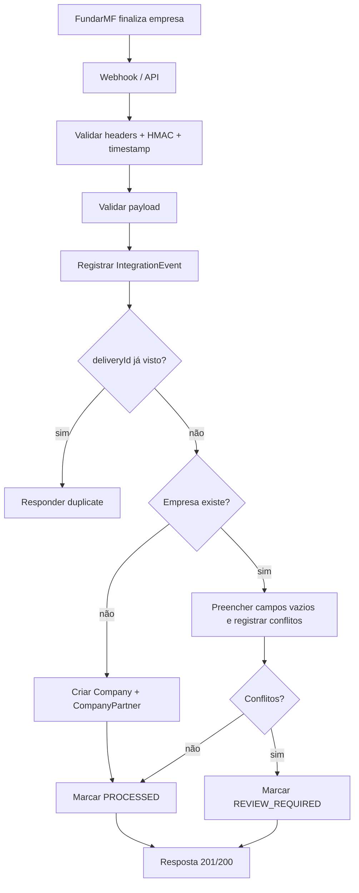

# Integração FundarMF

## Diagnóstico

- O projeto já tinha um webhook em `app/api/webhooks/fundarmf/route.ts`, mas o fluxo antigo apenas criava `PendingCompany` para triagem manual.
- O banco já possuía `Company`, `CompanyPartner`, `WebhookDelivery`, `PendingCompany` e trilha de auditoria, mas faltavam campos para endereço, origem externa, case id e eventos de integração.
- A lógica de importação existente já mostrava boas práticas de idempotência e deduplicação, então a nova integração reaproveita esses princípios.

## Estratégia recomendada

- Canal principal: Webhook/API.
- Endpoint principal: `POST /api/integrations/fundarmf/company-created`.
- Endpoint legado preservado: `POST /api/webhooks/fundarmf` aponta para o mesmo handler.
- Segurança:
  - HMAC em `x-fundarmf-signature`.
  - Timestamp em `x-fundarmf-timestamp` com janela configurável.
  - `delivery-id` obrigatório para idempotência.
  - API key opcional em `x-fundarmf-api-key`.
  - `origin` opcional validado por allowlist, quando configurado.

## Fluxo

1. FundarMF conclui o processo e envia o webhook.
2. O sistema valida headers, assinatura e tolerância de timestamp.
3. O payload é validado com schema e regras de negócio.
4. O evento é registrado em `IntegrationEvent`.
5. O sistema verifica duplicidade por `deliveryId`.
6. Se a empresa não existir, ela é criada com endereço, contatos e sócios.
7. Se a empresa já existir, o sistema só preenche campos vazios e registra conflitos.
8. Sócios novos são adicionados sem duplicar os existentes.
9. O evento é marcado como `PROCESSED`, `REVIEW_REQUIRED` ou `FAILED`.
10. A API responde com sucesso controlado ou erro controlado.



## Mapeamento de campos

- `company.cnpj` -> `Company.cnpj` / `Company.cnpjNumerico`
- `company.razao_social` -> `Company.razaoSocial`
- `company.nome_fantasia` -> `Company.nomeFantasia`
- `company.status` -> `Company.statusCadastral` e `Company.ativo`
- `company.data_abertura` -> `Company.dataAbertura`
- `company.regime_tributario` -> `Company.regimeTributario`
- `company.cnae_principal` -> `Company.cnaePrincipal`
- `company.cnaes_secundarios` -> `Company.cnaesSecundarios`
- `company.email` -> `Company.emailContato`
- `company.email_alternativo` -> `Company.emailContatoAlternativo`
- `company.telefone` -> `Company.telefoneContato`
- `company.whatsapp` -> `Company.whatsappContato`
- `company.endereco.cep` -> `Company.cep`
- `company.endereco.logradouro` -> `Company.logradouro`
- `company.endereco.numero` -> `Company.numero`
- `company.endereco.complemento` -> `Company.complemento`
- `company.endereco.bairro` -> `Company.bairro`
- `company.endereco.cidade` -> `Company.cidade` e `Company.municipio`
- `company.endereco.uf` -> `Company.uf`
- `fundarmf_case_id` -> `Company.fundarmfCaseId` e `IntegrationEvent.fundarmfCaseId`
- Sócios -> `CompanyPartner`

## Banco de dados

- Novos campos em `Company`:
  - `statusCadastral`
  - `dataAbertura`
  - `cep`, `logradouro`, `numero`, `complemento`, `bairro`, `cidade`, `uf`
  - `cnaePrincipal`, `cnaesSecundarios`
  - `emailContatoAlternativo`, `whatsappContato`, `whatsappContatoNumerico`
  - `externalOrigin`, `fundarmfCaseId`, `importedAt`, `lastSyncedAt`, `syncStatus`
- Novos campos em `CompanyPartner`:
  - `cpf`, `cpfNormalizado`
  - `email`, `emailNormalizado`
  - `participacao`, `cargo`
- Nova tabela `IntegrationEvent` para auditoria, dedupe e reprocessamento.

## Variáveis de ambiente

```bash
FUNDARMF_WEBHOOK_SECRET=
FUNDARMF_API_KEY=
FUNDARMF_ALLOWED_ORIGIN=
FUNDARMF_WEBHOOK_TOLERANCE_SECONDS=300
```

## Testes

- Payload válido cria empresa, endereço e sócios.
- Sem assinatura correta, o webhook é recusado.
- Payload sem CNPJ é rejeitado.
- Entrega repetida não duplica processamento.
- Empresa já existente não é sobrescrita sem regra clara.
- Payload inválido é registrado como evento de falha.
- Evento falho pode ser reprocessado por admin.

## MCP

- Não é necessário como caminho principal.
- A integração principal deve continuar sendo Webhook/API.
- Um MCP pode ser útil no futuro para:
  - consultar empresa por CNPJ;
  - validar payload;
  - simular webhook;
  - listar eventos com falha;
  - reprocessar eventos.

## Endpoints administrativos

- `GET /api/admin/integrations/fundarmf/events`
  - Lista eventos da integração.
  - `status` é opcional.
  - `take` limita o volume.
- `POST /api/admin/integrations/fundarmf/events/:id/retry`
  - Reprocessa um evento com base no payload salvo.
  - Aceita apenas eventos `FAILED` ou `REVIEW_REQUIRED`.
  - Mantém idempotência e revalida tudo antes de escrever no banco.

## Checklist de produção

- Definir `FUNDARMF_WEBHOOK_SECRET`.
- Definir `FUNDARMF_API_KEY` se quiser defesa em profundidade.
- Configurar `FUNDARMF_ALLOWED_ORIGIN` se houver origem controlada.
- Aplicar a migration `20260605_fundarmf_integration`.
- Garantir que FundarMF assine `timestamp + event + deliveryId + body`.
- Monitorar `IntegrationEvent` com status `FAILED` e `REVIEW_REQUIRED`.
- Revisar manualmente conflitos antes de permitir sobrescrita.
- Usar retry admin apenas em eventos falhos/revisão.
